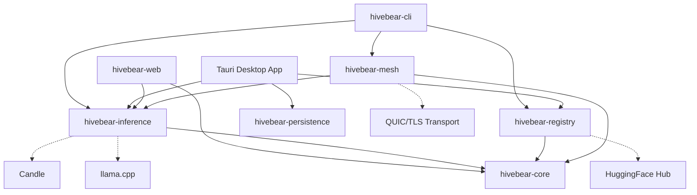

<p align="center">
  
</p>

<h1 align="center">HiveBear</h1>

<p align="center">
  <strong>AI that fits your machine.</strong><br>
  Run open-source LLMs on any device, from Raspberry Pis to gaming PCs, regardless of GPU.
</p>

<p align="center">
  <a href="https://github.com/BeckhamLabsLLC/HiveBear/actions"></a>
  <a href="https://github.com/BeckhamLabsLLC/HiveBear/blob/main/LICENSE"></a>
  <a href="https://crates.io/crates/hivebear-cli"></a>
</p>

---

## What is HiveBear?

Most tools for running local AI models make you figure out what your hardware can handle. HiveBear doesn't. It **profiles your device**, **recommends the best model**, and **runs it** -all in one command:

```bash
hivebear quickstart
```

That's it. HiveBear detects your CPU, RAM, GPU, and storage, picks the optimal model and quantization for your specific hardware, downloads it, and drops you into an interactive chat. No manual model selection, no config files, no guessing.

### Key Features

- **Hardware-aware model selection** -Auto-detects your device and recommends models that actually fit. No more OOM crashes from blindly loading a 13B model on 8GB RAM.
- **Multi-engine orchestration** -Automatically picks the best inference engine (llama.cpp, Candle, or more) based on your hardware and the model format.
- **P2P mesh distributed inference** -Pool devices together over the internet to run models too large for any single machine. Your laptop + your desktop = one big inference cluster.
- **OpenAI-compatible API** -Drop-in replacement for OpenAI's API. Point your existing tools at `localhost:8080` and use local models with zero code changes.
- **Model registry** -Search, download, and manage models from HuggingFace with one command. Resumable downloads, integrity verification, format conversion.
- **Native desktop app** -Full-featured GUI with hardware dashboard, model browser, chat interface, and benchmark tools.
- **Cross-platform** -Linux, macOS, Windows, ARM (Raspberry Pi), and browser (WASM) support.

## How It Compares

| Feature | HiveBear | Ollama | LM Studio | Jan.ai |
|---------|----------|--------|-----------|--------|
| Auto hardware profiling | **Yes** | No | No | No |
| Smart model recommendation | **Yes** | No | No | No |
| Multi-engine (llama.cpp + Candle + more) | **Yes** | llama.cpp only | llama.cpp only | llama.cpp only |
| P2P distributed inference | **Yes** | No | No | No |
| OpenAI-compatible API | Yes | Yes | Yes | Yes |
| Native GUI | Yes | No | Yes | Yes |
| Browser inference (WASM) | **Yes** | No | No | No |
| Open source | MIT | MIT | Proprietary | AGPL |
| Written in | Rust | Go | C++/Electron | TypeScript |

## Quick Start

### Install

```bash
# One-line install (Linux/macOS)
curl -fsSL https://raw.githubusercontent.com/BeckhamLabsLLC/HiveBear/main/install.sh | bash

# Homebrew (macOS)
brew install BeckhamLabsLLC/hivebear/hivebear

# Docker
docker run -it --rm -p 11434:11434 ghcr.io/beckhamlabsllc/hivebear quickstart

# Docker with NVIDIA GPU
docker run -it --rm --gpus all -p 11434:11434 ghcr.io/beckhamlabsllc/hivebear:latest-cuda quickstart

# Build from source
cargo install --git https://github.com/BeckhamLabsLLC/HiveBear hivebear-cli

# Or clone and build
git clone https://github.com/BeckhamLabsLLC/HiveBear.git
cd HiveBear && cargo build --release
```

### Run

```bash
# The magic command -profiles, recommends, installs, and chats
hivebear quickstart

# Or step by step:
hivebear profile              # See what your hardware can do
hivebear recommend            # Get personalized model recommendations
hivebear install llama-3.1-8b # Download a model
hivebear run llama-3.1-8b     # Chat with it
```

### API Server

```bash
# Start an OpenAI-compatible API server
hivebear run llama-3.1-8b --api --port 8080

# Use it with any OpenAI-compatible client
curl http://localhost:8080/v1/chat/completions \
  -H "Content-Type: application/json" \
  -d '{
    "model": "llama-3.1-8b",
    "messages": [{"role": "user", "content": "Hello!"}],
    "stream": true
  }'
```

### P2P Mesh

```bash
# Contribute your idle compute to The Hive mesh
hivebear mesh start --port 7878

# Run a large model across multiple devices
hivebear mesh run llama-3.1-70b --prompt "Explain quantum computing"
```

### Desktop App

Download the native desktop app from [Releases](https://github.com/BeckhamLabsLLC/HiveBear/releases), or build from source:

```bash
cd apps/desktop
npm install
cargo tauri dev
```

## Architecture

HiveBear is a Rust workspace with clean crate boundaries:

```
hivebear/
├── hivebear-core          Hardware profiling, model recommendations, config
├── hivebear-inference     Multi-engine inference orchestrator (llama.cpp, Candle, ONNX, MLX)
├── hivebear-registry      Model discovery, download, conversion, storage management
├── hivebear-mesh          P2P distributed inference via QUIC transport
├── hivebear-persistence   Conversation persistence (SQLite)
├── hivebear-cli           CLI interface + OpenAI-compatible API server
├── hivebear-web           WASM bridge for browser-based inference via WebGPU
└── apps/desktop           Tauri 2.x desktop app (Rust backend + React frontend)
```



## CLI Reference

```
hivebear profile                    Show hardware profile
hivebear recommend [--json] [--top N]  Get model recommendations
hivebear benchmark [--duration N]   Run inference benchmark
hivebear quickstart                 Profile -> recommend -> install -> chat (one command)

hivebear search <query>             Search models on HuggingFace
hivebear install <model>            Download and install a model
hivebear list                       List installed models
hivebear remove <model>             Remove an installed model
hivebear convert <model> --to gguf  Convert model format
hivebear storage [--cleanup]        Show disk usage

hivebear run <model>                Interactive chat
hivebear run <model> --prompt "..." Single generation
hivebear run <model> --api          Start OpenAI-compatible API server
hivebear engines                    List available inference engines

hivebear mesh start                 Join the P2P mesh network
hivebear mesh status                Show connected peers
hivebear mesh run <model>           Distributed inference across mesh
hivebear mesh stop                  Leave the mesh

hivebear config show|path|reset     Manage configuration
```

## Hardware Support

HiveBear adapts to whatever you have:

| Device Class | RAM | What You Can Run |
|-------------|-----|-----------------|
| Raspberry Pi 5 | 8 GB | TinyLlama 1.1B, Phi-2 2.7B |
| Old laptop | 8 GB | Llama 3.1 8B (Q4), Mistral 7B (Q4) |
| Gaming PC | 16 GB | Llama 3.1 8B (Q8), CodeLlama 13B (Q4) |
| Workstation | 32+ GB | Llama 3.1 70B (Q4), Mixtral 8x7B |
| Multi-device mesh | Any | Models too large for any single device |

GPU acceleration is automatic when available (CUDA, Metal, Vulkan, WebGPU).

## Contributing

We welcome contributions! See [CONTRIBUTING.md](CONTRIBUTING.md) for guidelines.

Good first issues:
- Add GPU bandwidth entries to the [hardware database](crates/hivebear-core/src/recommender/scoring.rs)
- Add models to the [recommendation database](crates/hivebear-core/src/recommender/model_db.rs)
- Improve CLI output formatting

## License

MIT License. See [LICENSE](LICENSE) for details.
